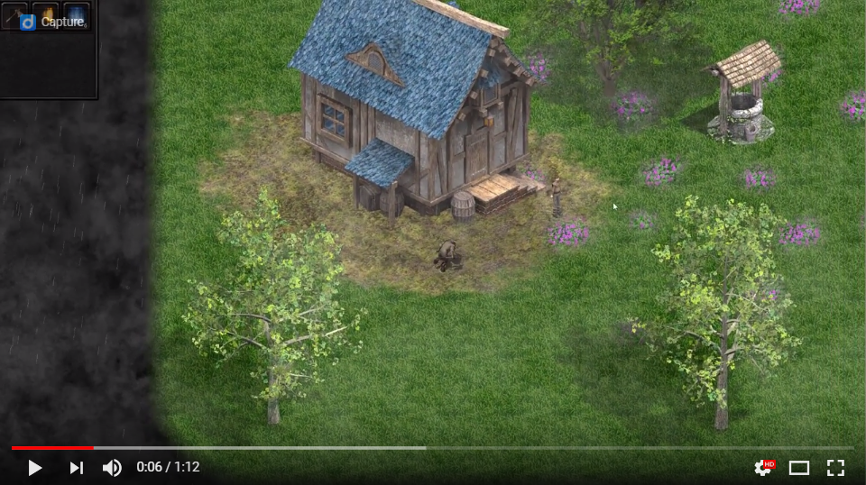

Welcome to the Qt Game Engine repository!

Qt Game Engine (QGE) is a game engine written in C++ built on top of the amazing Qt framework. It presents a very **easy** and more importantly, a **fun** to use interface for creating your own 2d games from a top down or angled (e.g. isometric-like) viewpoint. The game engine is very **well written**, **well documented**, and **easily extensible**.

Click the picture below to view a video of the engine in action.

I've written the engine with my top priority being that it is fun to use. For me, building things by plugging a bunch of different parts together and wiring them correctly is insanely fun, so that is how i've designed the engine to be. 

If you just want to use the engine to build your own game (not necessarly contribute to the engine codebase itself), then head over to the [documentation](index.html). I sincerely hope you enjoy *using* the game engine as much as I enjoyed *making* it.

Currently, I work full time and am a full time master's student, but I promise to allocate as much free time as I can muster to support the continued development of this engine.

I warmly welcome anyone who would like to contribute to the engine. If you would like to contribute, familiarize yourself with *using* the game engine first, then head on over to the [contribution guidelines page](CONTRIBUTING.md).